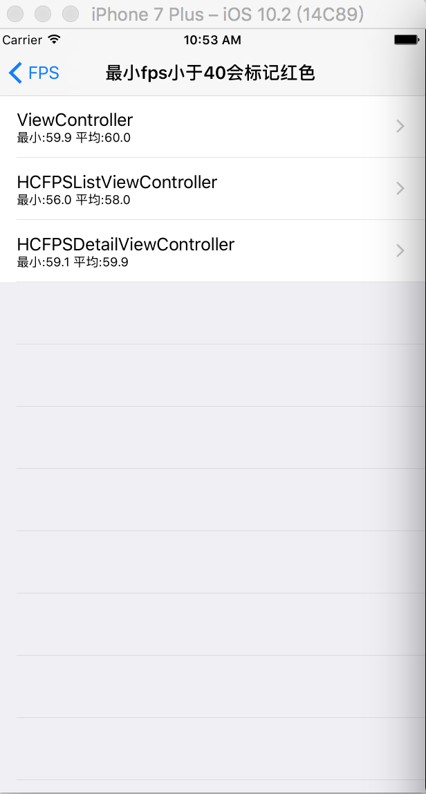
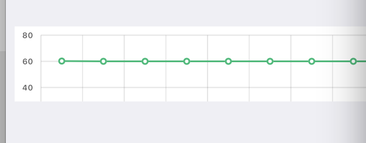

# FPSOfViewController
------------
[TOC]
## 功能介绍
 1. 统计每个界面的FPS的变化曲线

------------------
## 如何使用
* 将HCFPS目录下的Classes加入到工程中
* 默认是DEBUG模式下会去统计界面的FPS信息，如果想却掉这个限制，在下面的代码将条件编译的去掉
```swift
@implementation UIViewController (FPS)

+ (void)load
{
#if DEBUG
    static dispatch_once_t onceToken;
    dispatch_once(&onceToken, ^{
        Method didLoadMethod = class_getInstanceMethod(self, @selector(viewDidLoad));
        Method fps_didLoadMethod = class_getInstanceMethod(self, @selector(fps_viewDidLoad));
        method_exchangeImplementations(didLoadMethod, fps_didLoadMethod);
        
        Method viewWillDisappearMethod = class_getInstanceMethod(self, @selector(viewWillDisappear:));
        Method fps_viewWillDisappearMethod = class_getInstanceMethod(self, @selector(fps_viewWillDisappear:));
        method_exchangeImplementations(viewWillDisappearMethod, fps_viewWillDisappearMethod);
    });
#endif
}
```
* 有些界面你不想去统计FPS信息，也可以设置忽略一些类的实例不统计
```swift
+ (void)initialize
{
    static dispatch_once_t onceToken;
    dispatch_once(&onceToken, ^{
        _ignoreControllers = @[@"UICompatibilityInputViewController",
                              @"UIAlertController",
                              @"UISplitViewController",
                              @"UIInputWindowController"];
    });
}

```
* 运行效果图




点击可以查看某个控制器的FPS的变化曲线




